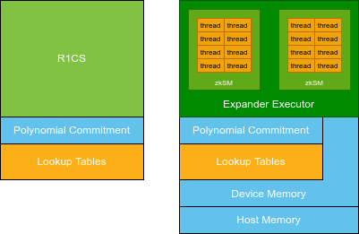

# Programming Guide

## Introduction

### The benefits of using Expander-Accelerated GKR circuits

The Expander protocol provides much higher throughput and use less memory (both in capacity and bandwidth) than existing provers. This difference in capabilites comes from the underlying algorithm difference between Expander and other protocols. The algorithm itself removes a $O(\log{N})$ factor compares to other protocols, and the circuit size in zkCUDA is also more compact.

zkCUDA is specialized for highly parallelizable computation, where it's another attempt to describe log-space uniformity of the circuit.

Instead of processing a un-structured computation, zkCUDA compiler makes your computation more structured to prover and with a $O(\log{N})$ faster algorithm combined, the result is a much faster and cheaper proof system.

### 