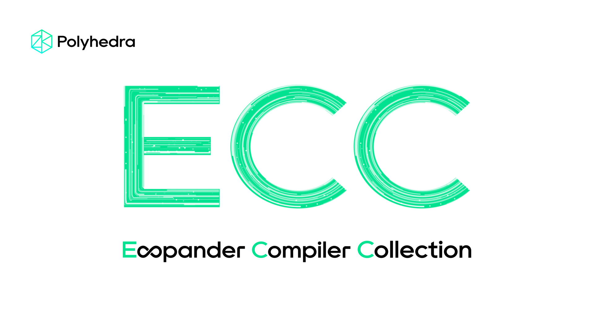

# ExpanderCompilerCollection

Expander is a proof generation backend for the Polyhedra Network. The ExpanderCompilerCollection is a component of the Expander proof system. It transforms circuits written in [gnark](https://github.com/Consensys/gnark) into an intermediate representation (IR) of a layered circuit. This IR can later be used by the [Expander prover](https://github.com/PolyhedraZK/Expander) to generate proofs.

## Documentation

Documentation is available at [Expander Compiler Collection Documentation](https://polyhedrazk.github.io/ExpanderDocs/).

## Using this Library

To incorporate the compiler into your Go project, include the following import statement in your code:

```go
import "github.com/PolyhedraZK/ExpanderCompilerCollection"
```

We also have a [Rust frontend](https://polyhedrazk.github.io/ExpanderDocs/docs/rust/intro) similar to gnark.

## Example 

Refer to [this example](https://polyhedrazk.github.io/ExpanderDocs/docs/go/example) for a practical demonstration of our compiler. In this example, we illustrate how a gnark circuit can be compiled using `ExpanderCompilerCollection`. The output of this example includes a circuit description file `"circuit.txt"` and a corresponding witnesses file `"witness.txt"`. Our prover, [Expander](https://github.com/PolyhedraZK/Expander), utilizes these IRs to generate the actual proof.

## Acknowledgement

We extend our gratitude to the following projects, whose prior work has been crucial in bringing this project to fruition:

[gnark](https://github.com/Consensys/gnark): our frontend language is based on gnark's frontend.

## Future Roadmap

As a compiler collection, we will support more circuit frontend languages in the near term.

## Features in Progress
* On-chain verifier generation
* Extended in-circuit randomness generation